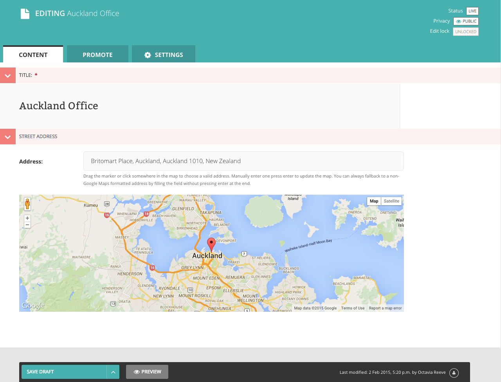
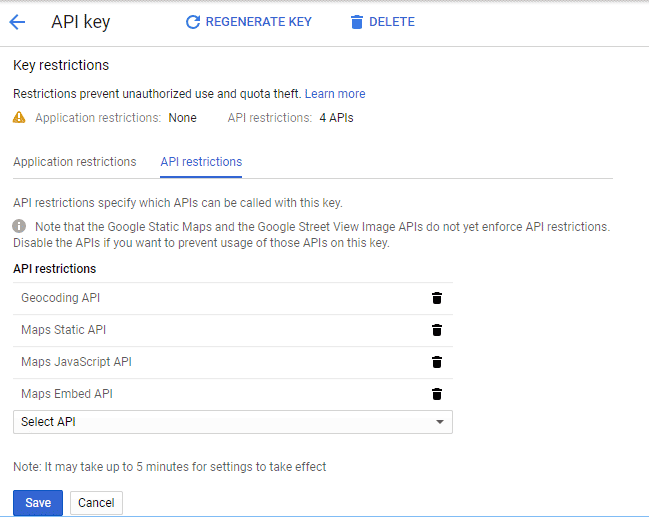

# wagtailgmaps [](https://pypi.python.org/pypi/wagtailgmaps)

> Simple Google Maps address formatter and LatLng provider for [Wagtail](https://wagtail.io/) fields.

*Check out [Awesome Wagtail](https://github.com/springload/awesome-wagtail) for more awesome packages and resources from the Wagtail community.*



## Quickstart

### Setting Up Your Google API Key

1. Follow the instructions to [get a key](https://developers.google.com/maps/documentation/javascript/get-api-key)
2. Enable the following services under `API Restrictions`:
    * [Geocoding API](https://developers.google.com/maps/documentation/javascript/geocoding)
    * [Maps Static API](https://developers.google.com/maps/documentation/static-maps/)
    * [Maps JavaScript API](https://developers.google.com/maps/documentation/javascript/)
    * [Maps Embed API](https://developers.google.com/maps/documentation/javascript/)



### Installing and Configuration the Python Package

1. Install with `pip install wagtailgmaps`
2. Add `wagtailgmaps` to your `settings.py` `INSTALLED_APPS` section.
3. Add some configuration in your `settings.py` file:

    ```python
    # Mandatory
    WAGTAIL_ADDRESS_MAP_CENTER = 'Wellington, New Zealand'  # It must be a properly formatted address
    WAGTAIL_ADDRESS_MAP_KEY = 'xxx'

    # Optional
    WAGTAIL_ADDRESS_MAP_ZOOM = 8  # See https://developers.google.com/maps/documentation/javascript/tutorial#MapOptions for more information.
    WAGTAIL_ADDRESS_MAP_LANGUAGE = 'ru'  # See https://developers.google.com/maps/faq#languagesupport for supported languages.
    ```

4. Use it:

    ```python
    # myapp/models.py
    from django.db import models
    from wagtail.wagtailcore.models import Page
    from wagtailgmaps.edit_handlers import MapFieldPanel

    class MapPage(Page):
        # Wagtailgmaps expects a `CharField` (or any other field that renders as a text input)
        formatted_address = models.CharField(max_length=255)
        latlng_address = models.CharField(max_length=255)

        # Use the `MapFieldPanel` just like you would use a `FieldPanel`
        content_panels = Page.content_panels + [
            MapFieldPanel('formatted_address'),
            MapFieldPanel('latlng_address', latlng=True),
        ]
    ```

    ```html
    # myapp/templates/myapp/map_page.html
    <a href="http://maps.google.com/?q={{ self.formatted_address }}">Open map (Formatted Address)</a>
    <a href="http://maps.google.com/?q={{ self.latlng_address }}">Open map (Lat/Long Address)</a>
    ```

## Additional information

### `MapFieldPanel` options

 - `heading` - A custom heading in the admin, defaults to "Location"
 - `classname` - Add extra css classes to the field
 - `latlng` - Field returns a LatLng instead of an address
 - `centre` - A custom override for this field
 - `zoom` - A custom override for this field

### How the address option works under the hood

If using the address option, the field gets updated according to the [Google Geocoding Service](https://developers.google.com/maps/documentation/geocoding/) each time:

* The map marker gets dragged and dropped into a location (`dragend` JS event).
* Click happens somewhere in the map (`click` JS event).
* Return key is pressed after editing the field (`enterKey` JS event for return key only).

### Troubleshooting

When editing the model from the admin interface the affected field shows up with a map, like the screenshot above. If it doesn't, check your browser console to make sure that there is no error related to your API key.

## Development

### Releases

- Make a new branch for the release of the new version.
- Update the [CHANGELOG](https://github.com/springload/wagtailgmaps/CHANGELOG.md).
- Update the version number in `wagtailgmaps/__init__.py`, following semver.
- Make a PR and squash merge it.
- Back on master with the PR merged, use `make publish` (confirm, and enter your password).
- Finally, go to GitHub and create a release and a tag for the new version.
- Done!
